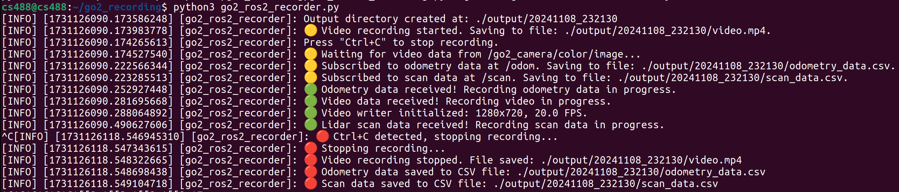

# go2_ros2_recorder

**go2_ros2_recorder** is a versatile script designed to work with the [go2_ros2_sdk](https://github.com/akifbayram/go2_ros2_sdk) for the Unitree Go2 robot and the TurtleBot4. It records video streams from the robot's camera, along with odometry and LIDAR scan data, saving them into organized and timestamped files for easy analysis and processing. Optimized for single-robot setups, it can also be configured via parameters for namespaced robots.



## Tested Prerequisites

- **Operating System**: Ubuntu 22.04
- **ROS2 Distribution**: Humble
- **Robot SDKs**:
  - [go2_ros2_sdk](https://github.com/akifbayram/go2_ros2_sdk) for Unitree Go2
  - [turtlebot4](https://github.com/turtlebot/turtlebot4) for TurtleBot4
- **Python Dependencies**:
  - OpenCV (`opencv-python`)
  - `cv_bridge`

## Installation

**Clone the Repository**

```bash
git clone https://github.com/akifbayram/go2_ros2_recorder.git
cd go2_ros2_recorder
```

## Usage

1. **Ensure `go2_ros2_sdk` or `turtlebot4` is Running**

   Make sure the appropriate SDK is active and publishing the necessary topics for your robot.

2. **Run the Script**

   ```bash
   python ros2_recorder.py
   ```

3. **Configure Parameters (Optional)**

   You can customize the script's behavior using command-line arguments.

   **Examples:**

   - **Default Run for Go2:**

     ```bash
     python ros2_recorder.py
     ```

   - **Run for TurtleBot4 with Namespace `/robot1`:**

     ```bash
     python ros2_recorder.py --robot_type turtlebot4 --namespace /robot1
     ```

   - **Run with Custom Topics:**

     ```bash
     python ros2_recorder.py \
       --robot_type turtlebot4 \
       --namespace /robot1 \
       --image_topic /custom_camera/image \
       --odom_topic /custom_odom \
       --scan_topic /custom_scan
     ```

   - **Run with All Parameters Specified:**

     ```bash
     python ros2_recorder.py \
       --output_directory "/home/user/ros_output" \
       --robot_type go2 \
       --namespace /my_robot \
       --image_topic /my_robot/camera/image \
       --odom_topic /my_robot/odom \
       --scan_topic /my_robot/scan \
       --video_filename my_video.mp4 \
       --odom_filename my_odometry.csv \
       --scan_filename my_scan.csv \
       --video_fps 30.0 \
       --video_codec XVID \
       --display_video \
       --check_interval 10.0 \
       --no_data_timeout 10.0
     ```

4. **Stop Recording**

   Press `Ctrl+C` in the terminal to stop recording.

## Acknowledgments

This project utilizes the excellent work from the following repositories:

- [tfoldi/go2-webrtc](https://github.com/tfoldi/go2-webrtc)
- [legion1581/go2_webrtc_connect](https://github.com/legion1581/go2_webrtc_connect)